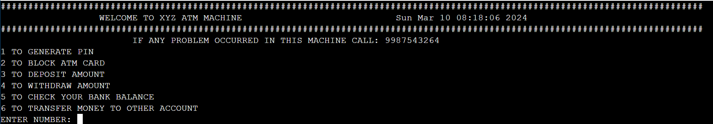
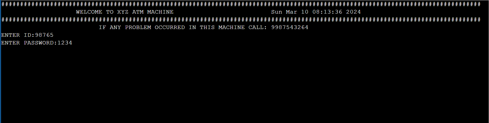

# ATM-MACHINE
ATM system with functionalities like account management, balance inquiry, and fund transfer, utilizing file handling for data persistence.

The Functionalities in the program are 
1) TO GENERATE PIN
2) TO BLOCK ATM PIN
3) TO DEPOSIT AMOUNT
4) TO WITHDRAW AMOUNT
5) TO CHECK BANK BALENCE
6) TO TRANSFER MONEY FROM ONE ACCOUNT TO ANOTHER ACCOUNT 
7) TO EMPLOYEE LOGIN(TO FILL AMOUNT/REPAIR ETC)

The main function is started by the employee that by entering the id and password for the machine 

Employee can even open for fill the money or in the situation of maintance empoyee can stop the machine 

the id and password are taken from the text file myfile.txt(first is employee id and second is password) which is in the repository

1) TO GENERATE PIN

this function asks the account number (insted of card) if the account number exists then asks for phone number if it matches then give permetion for changing the code

